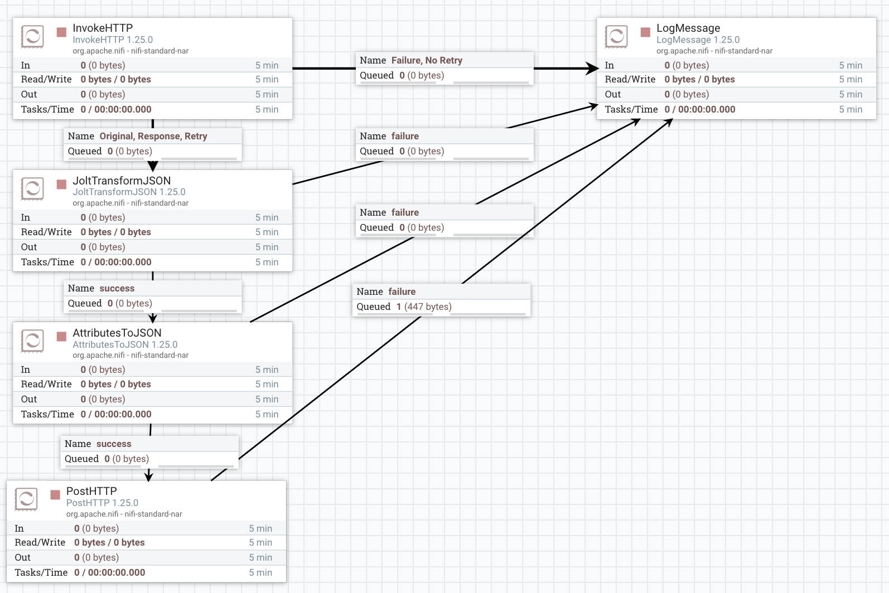

# Big Data Pipeline — Docker Compose Overview

Task shedulling - https://www.notion.so/9d41b0c0b076483b8eda32f2cb13bf0d?v=2b761f28fc798020a09b000ce390b754&source=copy_link

This project runs a lightweight data pipeline using **HDFS**, **Apache NiFi**, a **Flask ingester**, and **end-to-end tests**.  
It consists of **five containers** defined in `docker-compose.yml`.

## How to Run

```bash
docker-compose up --build
```

### Clean 

```bash
docker-compose down
```

---
## NIFI flow:


## Containers

### 1) NameNode
Main HDFS service storing **filesystem metadata** (namespace, block locations).  
- Image: `bde2020/hadoop-namenode`  
- Ports: `9000` (HDFS RPC), `9870` (Web UI / WebHDFS)  
- Volume: `hdfs_namenode`  

### 2) DataNode
Stores the actual **HDFS data blocks** and registers with the NameNode.  
- Image: `bde2020/hadoop-datanode`  
- Volume: `hdfs_datanode`  
- Depends on: NameNode  

### 3) hdfs-ingester
Flask microservice that receives JSON (`POST /ingest`) from NiFi and writes it to HDFS using WebHDFS.  
- Built from: `./hdfs_ingester`  
- Port: `5050`  
- Depends on: NameNode  

### 4) NiFi
Dataflow engine that sends processed data to the ingester API.  
- Image: `apache/nifi:1.25.0`  
- Port: `8080` (NiFi UI)  
- Volumes: templates + NiFi state  
- Depends on: hdfs-ingester  

### 5) tester
Runs end-to-end tests validating the entire pipeline (NiFi → Ingester → HDFS).  
- Built from: `./tests`  
- Depends on: NiFi, Ingester, NameNode  

---

## Persisted Data (Volumes)

| Volume          | Purpose                         |
|-----------------|---------------------------------|
| `hdfs_namenode` | HDFS metadata (NameNode)        |
| `hdfs_datanode` | HDFS data blocks (DataNode)     |
| `nifi_state`    | NiFi flow state & configuration |

---

## Key URLs

| Service      | URL                      |
|-------------|--------------------------|
| NameNode UI | http://localhost:9870    |
| NiFi UI     | http://localhost:8080    |
| Ingester API| http://localhost:5050/ingest |

---

